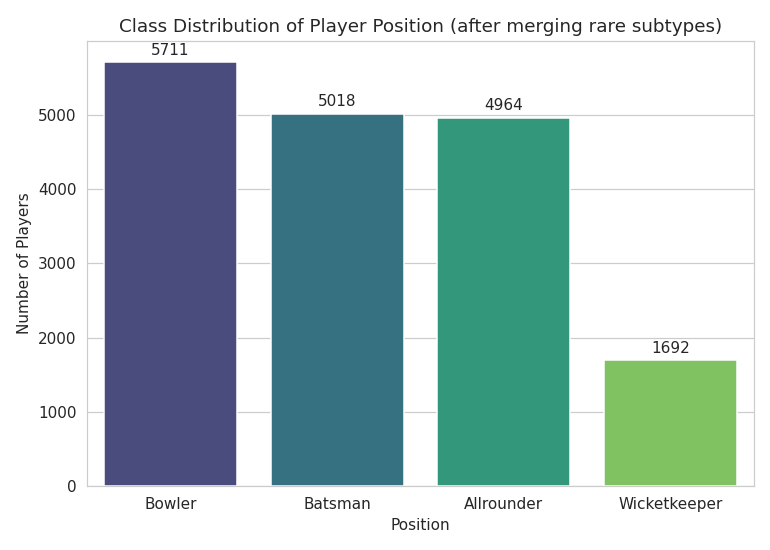
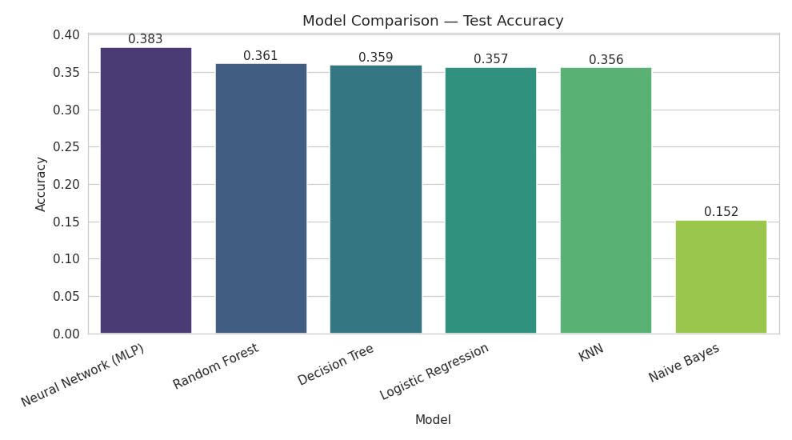
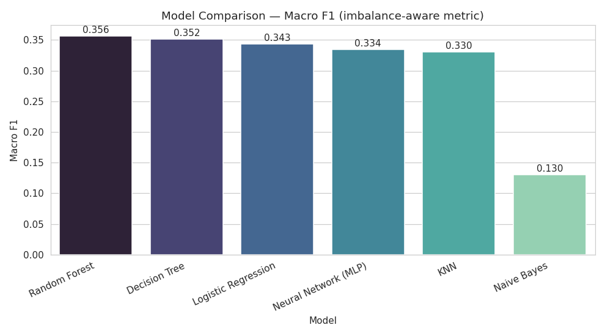
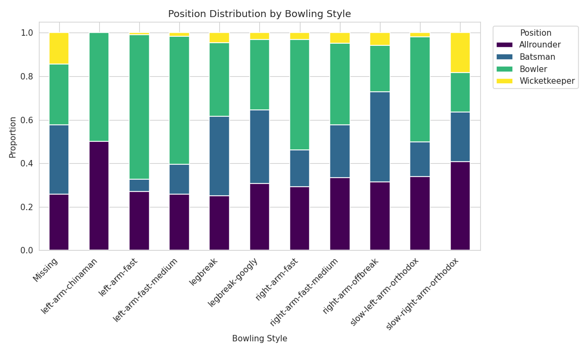

# Cricket Player Role Prediction

CSE422 (AI Lab) project. The idea is to see if I can predict a cricket player's role — Batsman, Bowler, Allrounder, or Wicketkeeper — just from their biographical/playing-style info, without knowing anything about their actual match stats.

## Problem

Normally a player's role is decided by coaches/scouts based on how they actually play. I wanted to check: can a model guess the role just from batting style, bowling style, continent, gender and age? Turns out — not very well, and that itself became an interesting finding (see Results below).

## Dataset

Given by our course faculty (shared here with permission) — a cricket players CSV with 17,385 rows and 16 columns. There's also a `teams.csv` (78 rows), but I ended up not using it as a feature — only ~15% of players actually matched a team by `country_id`, and whatever extra info it had was basically already covered by `continent_name`. Kept it in the repo anyway for reference.

Features I ended up using: `battingstyle`, `bowlingstyle`, `continent_name`, `gender`, `age` (had to build this myself from date of birth), and `is_dob_estimated` (a flag I added — explained below).

Target is `position`: Batsman / Bowler / Allrounder / Wicketkeeper. Not balanced at all — Bowler alone is ~33% of the data, Wicketkeeper is under 10%.

## What I did

- **EDA first** — checked class balance, correlation heatmap, and how batting style/bowling style/continent/age/gender relate to position.
- **Data cleaning** — this took a while. `dateofbirth` had 25 completely broken values (`0000-00-00` and similar) but also a sneakier issue: a huge chunk of rows (~6,081) had birthdates of exactly `01-01`, mostly in 2000–2004. That's way more than a normal random distribution would give (expected ~0.27%), so I'm fairly confident these are placeholder dates someone entered when the real DOB wasn't known — not real birthdays. I flagged these with `is_dob_estimated` instead of just deleting or ignoring them.
- **Preprocessing** — one-hot encoding for the categorical stuff, scaled age, stratified 80/20 split, and made sure the median-age fill for missing ages was fit only on the training data (didn't want any leakage from test set).
- **Models** — trained 6: Logistic Regression, KNN, Decision Tree, Naive Bayes, a small Neural Network (MLP), and Random Forest. All through the same pipeline so comparisons are fair. Used macro F1 as the main metric since accuracy alone is misleading with imbalanced classes. Also ran 5-fold cross-validation to make sure results weren't a fluke.
- **Bonus** — did K-Means clustering on the same features just to see if the data naturally groups into 4 clusters matching the real positions. (Spoiler: it doesn't really.)

## Results

| Model | Accuracy | Macro F1 | ROC-AUC |
|---|---|---|---|
| **Random Forest** | 0.3612 | **0.3563** | 0.6413 |
| Decision Tree | 0.3592 | 0.3516 | 0.6199 |
| Logistic Regression | 0.3566 | 0.3430 | 0.6458 |
| KNN | 0.3558 | 0.3302 | 0.6145 |
| Neural Network | 0.3831 | 0.3345 | 0.6467 |
| Naive Bayes | 0.1521 | 0.1303 | 0.6060 |

Random Forest came out on top (Macro F1 ≈ 0.356), and cross-validation confirmed it's stable (mean 0.3512 across folds, not just one lucky split).

**Why is the accuracy so low though?** Honestly — I think it's just a hard problem with these features. Bowler alone makes up ~33% of the data, so even a model that always guessed "Bowler" would land somewhere close to these numbers anyway. Batting/bowling style give the model *some* signal, but continent, gender and age barely help at all. The K-Means result backs this up too — silhouette scores stayed flat (0.30–0.34) no matter how many clusters I tried, meaning there's no strong natural grouping in this feature space that lines up with the 4 real positions. So I don't think this is a bug in my code — the available columns just don't carry enough information to nail this prediction, and I'd rather report that honestly than fudge something to look better.

## Figures






(more plots in `reports/figures/` — confusion matrices for each model, K-Means elbow/PCA plots, etc.)

## Files

```
├── CSE422_Project_PlayerRole.ipynb   # everything — EDA, cleaning, models, evaluation
├── CSE422_Project_Report.pdf         # written report
├── players_data_with_all_info.csv    # main dataset
├── teams.csv                         # inspected but not used as a feature (see Dataset section)
├── reports/figures/                  # all the saved plots
├── requirements.txt
└── README.md
```

## Running it

```bash
pip install -r requirements.txt
jupyter notebook CSE422_Project_PlayerRole.ipynb
```

The dataset CSVs are included in this repo, so you shouldn't need to change any paths if you clone it as-is — just make sure `players_data_with_all_info.csv` and `teams.csv` stay in the same folder as the notebook. (I originally built this in Google Colab loading from my own Drive, so if you see any leftover Drive paths in a cell, just point them to the local CSVs instead.)

## Built with

Python, pandas, NumPy, scikit-learn, matplotlib, seaborn
